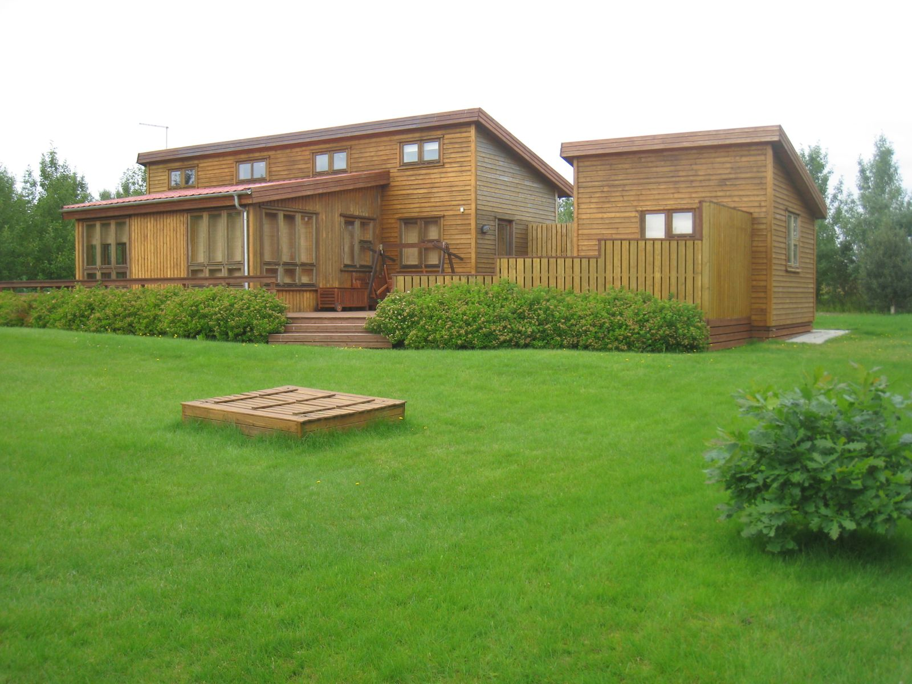

# Mótin

Helstu mót klúbbsins og eftirminnilegir viðburðir.

## Mótahald og íþróttaiðkun

Á árinu 2016 eignaðist GF tvo nýja dómara þegar þau Anna Sigurðardóttir og Sveinn Karlsson fengu réttindi sín. Hafa þau Anna og Sveinn unnið samfellt mikið sjálfboðaliðastarf við dómgæslu, verið í mótanefnd, aga- og forgjafarnefnd og komið að unglingastarfi öll þau 10 ár sem hér eru til umfjöllunar og eiga mikinn heiður skilið fyrir sitt mikla og óeigingjarna framlag.

Helgi Guðmundsson var formaður mótanefndar 2015 til 2020 en þá tók Unnsteinn Eggertsson við því starfi og gegndi til loka árs 2021. Á klúbburinn þeim báðum mikið að þakka því það gera sér ekki allir grein fyrir hve mikið starf fer fram í mótanefndinni. Fyrst þarf að skipuleggja mót, sjá til þess að völlur í samráði við vallarnefnd sé rétt upp settur, finna þarf til dómara, auglýsa og sjá um skráningar í mót -breytingar fram á síðustu stundu, raða niður hollum, afla verðlauna, fylgjast með framkvæmd mótsins, sjá um útreikning og úrskurða um vafaatriði, birta úrslit og afhenda verðlaun. Allt þetta tekur ómældan tíma sem unninn er í sjálfboðavinnu að sjálfsögðu.

Eftir að samningur var gerður við Hrunamannahrepp 2016 voru haldin golfnámskeið fyrir ungmenni á Selsvelli. Var fyrrverandi formaður Karl Gunnlaugsson þar fremstur í flokki til að byrja með ásamt Halldóri Guðnasyni, Herdísi Sveinsdóttur, Önnu Sigurðardóttur og Sveini Karlssyni, en síðar kom Árni Sigurðsson íþróttakennari á Flúðum og félagsmaður í GF og Árni formaður meira inn í myndina ásamt Katrínu Ólöfu Ástvaldsdóttur, Vilhelmínu Þóru Þorvarðardóttur og öðrum stjórnarmönnum. Árið 2017 var Ástráður Sigurðsson, golfkennari með PGA réttindi og félagi í klúbbnum ráðinn og hélt hann þrjú námskeið yfir sumarið, einkum ætluð byrjendum og unglingum. Á árinu 2018 voru haldin 4 námskeið, 3 á árinu 2019, 4 árið 2020 og 5 árið 2021. Eftir eigendaskipti að vellinum 2022 hefur umfangið heldur aukist og þátttakan hefur vaxið eftir því sem námskeiðum fjölgaði og þetta varð að reglulegum viðburði yfir sumarið.

Þátttaka GF í GSÍ mótum hefur verið takmörkuð. Mótast það af því að yfirgnæfandi fjöldi félagsmanna í GF eru sumarbústaðaeigendur, sem komnir eru um og yfir fimmtugt. Hefur þátttakan ýmist tengst mótum eldri kylfinga og einstöku sinnum unglingamótum, en árangur verið misjafn. Á seinni árum hefur GF lagt sig fram um að aðstoða GSÍ við að halda Íslandsmót yngri kylfinga og verður vikið nánar að því síðar.

Á árinu 2019 gengu fimm ungir drengir til liðs við GF og tóku þátt í GSÍ móti. Unnu þeir 4. deild og færðist GF því upp í 3 deild þar sem þeir heldu sæti sínu árin 2020 og 2021.

Meistarmót hefur verið haldið árlega, en þátttaka verið minni en í mörgum öðrum klúbbum, þó ýmislegt hafi verið gert til að freista þess að auka þátttökuna. Sama má segja um bikarkeppni, en erfiðlega hefur gengið að fá almenna klúbbfélaga til þátttöku í öðru en skemmtimótum. Yfirlit um klúbbmeistara karla og kvenna auk fjölda þátttakenda er að finna í [viðauka](../vidaukar/umferd-og-mot.qmd).

Í gegn um tíðina hefur skapast sú skemmtilega hefð að lið frá GF hefur keppt við lið frá öðrum klúbbum eða félagasamtökum. Hafa myndast skemmtileg tengsl milli aðila og má þar nefna Golfklúbb Selfoss, Lögregluna og fleiri.

Á árinu 2021 tók Kjartan Birgisson sig til og stofnaði fimmtudagsmótaröð, en um er að ræða innanfélagsmót þar sem félagsmenn koma saman, leika saman í liði með óformlegum hætti og koma svo saman í golfskála að leik loknum. Hefur þetta notið mikilla vinsælda hjá þeim sem sótt hafa og á Kjartan mikinn heiður skilið fyrir sitt framlag.

Yfirlit um þátttöku í mótum má finna í [viðauka](../vidaukar/umferd-og-mot.qmd).
